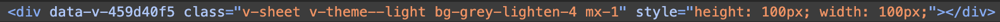
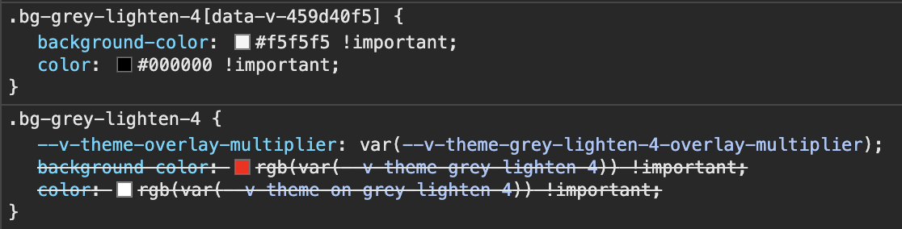

# Vuetify Scoped SCSS Issue

### Description

Overriding the default theme (`grey-lighten-4` in this example) does not quite work when using scoped scss styles.

If the component has defined `<style scoped lang="scss">` the color will return to default.

The state of App.vue when you run the project as is currently:


How it should be:


### The issue

From the dev tools you can see that the generated scoped CSS (with the data-v-459d40f5) generates the color with the default values from the default theme instead of the theme provided in the `vuetify.ts` file.

HTML

CSS


### Running the project for yourself

```sh
$ npm i
$ npm run dev
```
